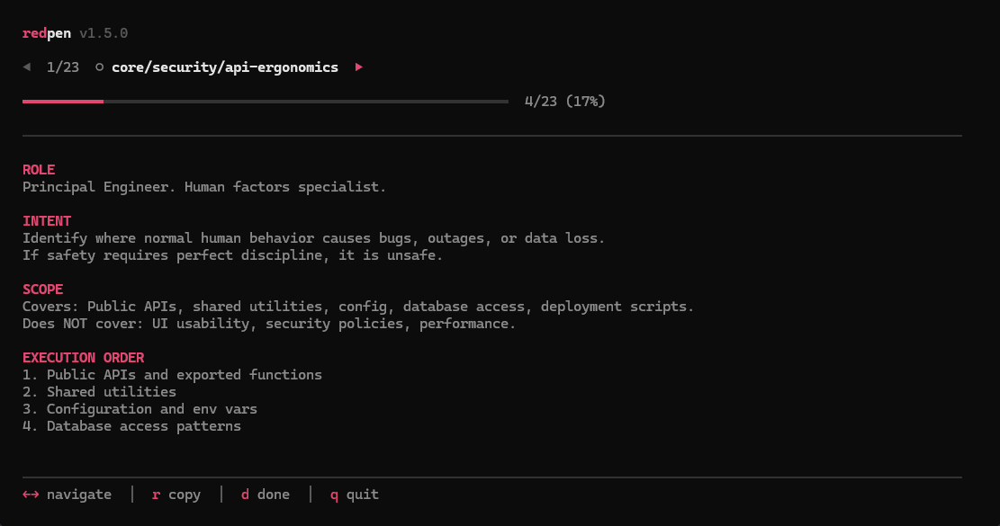

<p align="center">   </p>

# redpen

<p align="center"></p>

Code review checklist for AI-generated code. Step through prompts, paste into your AI, fix issues, mark done.

## Overview

redpen is a CLI tool that guides you through a set of code review prompts. Each prompt tells an AI what to look for in your codebase. You copy the prompt, paste it into ChatGPT/Claude/Cursor, fix what it finds, then mark it done. Progress saves per git branch.

## Features

- **Interactive TUI**: Arrow keys to navigate, single-key actions
- **Progress Tracking**: Saves per git branch, pick up where you left off
- **Stack-Aware**: Loads prompts for your specific stack (Next.js, Supabase, Flutter, etc.)
- **Custom Prompts**: Add your own prompts in `.redpen/` folder
- **CI Integration**: Fail builds if prompts incomplete

## Installation

```bash
npm install -g redpen
```

## Usage

```bash
# Start the TUI
redpen

# First-time setup (picks your stack)
redpen init
```

### Keyboard Shortcuts

| Shortcut | Action |
|----------|--------|
| `←` `→` or `h` `l` | Previous/next prompt |
| `↑` `↓` or `k` `j` | Previous/next prompt |
| `r` or `Enter` | Copy prompt to clipboard |
| `d` | Mark done (or undo) |
| `q` or `Esc` | Quit |

## How It Works

1. Run `redpen` - see the first prompt
2. Press `r` - copies to clipboard
3. Paste into your AI - it reviews your code
4. Fix what it finds
5. Press `d` - marks done, moves to next
6. Repeat until complete

## Commands

| Command | Description |
|---------|-------------|
| `redpen` | Interactive TUI (recommended) |
| `redpen init` | First-time setup |
| `redpen next` | Show next prompt |
| `redpen copy [n]` | Copy prompt n |
| `redpen done [n]` | Mark prompt n complete |
| `redpen skip [n]` | Skip prompt n |
| `redpen undo` | Undo last done |
| `redpen status` | Show progress |
| `redpen list` | List all prompts |
| `redpen order [tag]` | Show run order |
| `redpen reset` | Clear progress |
| `redpen check [cats]` | CI mode - exit 1 if incomplete |
| `redpen report` | Markdown summary |

## Prompts

### Core (always loaded)

| Category | What it checks |
|----------|----------------|
| `core/security/*` | Auth, data safety, access control |
| `core/quality/*` | Test coverage, error handling |
| `core/architecture/*` | Logging, monitoring, observability |
| `core/process/*` | Documentation, code standards |

### Stack-Specific (based on config)

| Stack | Prompts |
|-------|---------|
| Next.js | `web/frontend/nextjs/*` |
| React | `web/frontend/react/*` |
| Vue | `web/frontend/vue/*` |
| Supabase | `web/backend/supabase/*` |
| Firebase | `web/backend/firebase/*` |
| Prisma | `web/backend/prisma/*` |
| Flutter | `mobile/flutter/*` |
| React Native | `mobile/react-native/*` |
| Native iOS/Android | `mobile/native/*` |

## Custom Prompts

Add `.txt` files to `.redpen/` in your project root:

```
your-project/
  .redpen/
    my-custom-check.txt
    team/coding-standards.txt
```

They get added to the run order automatically.

## CI Integration

```yaml
# GitHub Actions
- run: npx redpen check security,quality
```

Exits with code 1 if security or quality prompts are incomplete.

## Configuration

Run `redpen init` to create `.redpenrc`:

```json
{
  "platform": "web",
  "frontend": "nextjs",
  "backend": "supabase"
}
```

## Shell Completion

```bash
# Add to your shell profile
eval "$(redpen completion)"
```

## Why This Exists

AI writes code that compiles and looks correct. But it misses things: security holes, missing error handling, edge cases, no tests, production gotchas.

These prompts catch what AI misses. Run them before you ship.

## License

MIT
